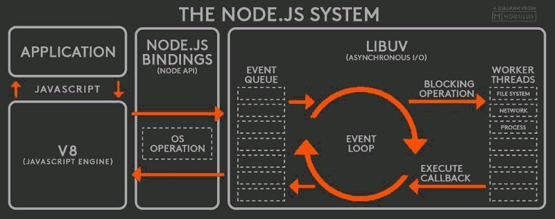

## How Node.js works?

Before coding it is essential to know how Node.js works. Under the hood Node.js applications use **Single Threaded Event Loop** to handle multiple concurrent clients, which is opposed to traditional "Multi-Threaded Request-Response" Model which is followed by technologies like JSP, Spring MVC and ASP .NET.
In order to start talking about Single Threaded Event Loop, you must understand the difference between blocking and non-blocking IO operations.

### Blocking vs. Non-Blocking IO operations

I/O refers to to interaction with the system's disk and network which is supported by libuv (explained later)
**Blocking** operation means that the execution of additional JavaScript in the Node.js process must wait until an I/O operation is completed. It is also known as **synchronous** operation.
**Non-Blocking** operation means that the execution of additional JavaScript in the Node.js process can continue while an I/O operation is being executed. It is also known as **asynchronous** operation.
I/O methods in the Node.js standard library are mostly non-blocking and accept callback functions. However, some of them have their blocking counterparts whose name beginns with `Sync`.

### Node.js architecture

As seen on the picture above, Node.js consists of these parts:
* **V8** is Google's open source JavaScript engine which is translating JavaScript code into machine code. V8 compiles JavaScript code into machine code at execution by implementing a JIT (Just-In-Time) compiler.
* **libuv** is a library for asynchronous I/O written in C. It implements Node.js' Event Loop.
* **Binding** is a wrapper around a library written in one language that exposes the library to codes written in another language which allows communication between codes written in different languages. It is necessary for commucication between V8 and libuv.
* **Application** is your code, modules and Node.js' built-in modules.

### How Event Loop works?
Event Loop is the core of Node.js. Here is an overview how it works:
Multiple clients are accessing web application concurrently. libuv has limited Thread Pool. Client's request comes into the Event Queue. Event Loop takes the first request in the Queue (FIFO). If the request is a simple operation, Event Loop forms the response and sends it back to the corresponding client immediately. On the other hand, if request needs DB or disk access, network activity or complex computation, Event Loop does not process the request, it assigns the request to the thread from the internal Thread Pool and takes another request from the Event Queue for processing.
When the thread has finished processing the request, it sends the response back to the Event Queue as if it was new request. When the Event loop fetches given response from the Event Queue, it either sends it back to the client or executes its callback the same way.

### Check out also:
* [Stack Overflow: Which is correct Node.js architecture?](https://stackoverflow.com/questions/36766696/which-is-correct-node-js-architecture)
* [Rambabu Posa: Node JS Architecture – Single Threaded Event Loop](https://www.journaldev.com/7462/node-js-architecture-single-threaded-event-loop)