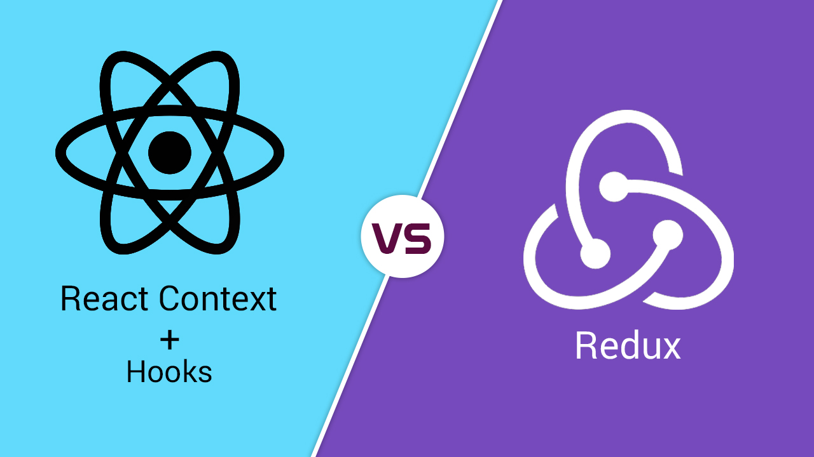

## React Hooks vs. Redux

### What is Redux?

Redux is a predictable state management library and architecture which easily integrates with React.
Redux characteristics:
* Deterministic state resolution (enabling deterministic view renders when combined with pure components)
* Transactional state
* Isolate state management from I/O and side-effects
* Single source of truth for application state
* Easily share state between different components
* Transaction telemetry (auto-logging action objects)
* Time travel debugging

### What are React Hooks?

React hooks let you use state and React lifecycle features without using `class` and React component lifecycle methods.
Hooks characteristics:
* Use state and hook into the component lifecycle without using a `class`
* Colocate related logic in one place in your component, rather than splitting it between various lifecycle methods
* Share reusable behaviors independent of component implementations (like the render prop pattern)

### When to use Hooks?

If your component:
* Doesn’t use the network
* Doesn’t save or load state
* Doesn’t share state with other non-child components
* Does not deal with any business logic or data processing shared with other parts of the application

### When to use Redux?

If your component:
* Uses I/O like network or device APIs
* Saves or loads state
* Shares its state with other non-child components
* Deals with any business logic or data processing shared with other parts of the application

### Check out also
* [Eric Elliot: Do React Hooks Replace Redux?](https://medium.com/javascript-scene/do-react-hooks-replace-redux-210bab340672)